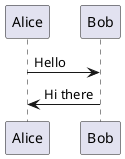
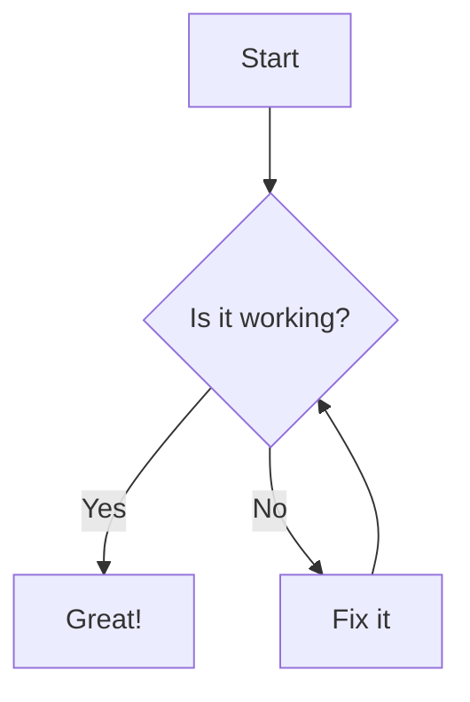

# MarkViewer

A powerful web-based markdown viewer with PlantUML, Mermaid, and search capabilities.

## Features

- 📝 **Markdown Rendering**: Full markdown support with GitHub-style rendering
- 🎨 **PlantUML Diagrams**: Render PlantUML diagrams using local plantuml.jar (SVG format)
- 📊 **Mermaid Diagrams**: Interactive Mermaid diagram rendering
- 🗂️ **Directory Navigation**: Recursive sidebar for easy file browsing
- 🔍 **Full-Text Search**: Search across all markdown files with preview snippets
- 💻 **Code Highlighting**: GitHub-style syntax highlighting with copy functionality
- 📱 **Responsive Design**: Works on desktop, tablet, and mobile devices
- ⚡ **Fast & Offline**: Local processing with caching for optimal performance

## Prerequisites

- **Node.js** (v14 or higher)
- **Java Runtime Environment** (for PlantUML support)
- **Modern web browser** (Chrome, Firefox, Safari, Edge)

## Quick Start

### 1. Clone and Setup

```bash
git clone <repository-url>
cd markviewer
npm run setup
```

This will:
- Install all dependencies for both frontend and backend
- Download the latest PlantUML jar file
- Verify Java installation

### 2. Start the Application

```bash
npm run dev
```

This starts:
- Backend API server on `http://localhost:3001`
- Frontend development server on `http://localhost:8080`

### 3. Open in Browser

Navigate to `http://localhost:8080` and:
1. Click "Select Workspace Directory"
2. Enter the path to your markdown files directory
3. Start browsing and searching your markdown files!

## Manual Setup

If the quick setup doesn't work, you can set up manually:

### Backend Setup

```bash
cd backend
npm install
```

### Frontend Setup

```bash
cd frontend
npm install
```

### PlantUML Setup

1. Download PlantUML jar:
```bash
node scripts/download-plantuml.js
```

2. Verify Java installation:
```bash
java -version
```

## Usage

### Directory Navigation

- Use the sidebar to browse your markdown files
- Click folders to expand/collapse them
- Click files to view their content
- Use keyboard shortcuts: Arrow keys for navigation, Enter to select

### Search Functionality

- Use the search box in the header to search across all files
- Search supports both plain text and regex patterns
- Click search results to navigate to specific files
- Use `Ctrl+K` (or `Cmd+K` on Mac) to quickly focus the search box

### PlantUML Diagrams

Create PlantUML diagrams using code blocks:



### Mermaid Diagrams

Create Mermaid diagrams using code blocks:



### Code Highlighting

All code blocks are automatically highlighted:

```javascript
function example() {
    console.log("Hello, World!");
}
```

### Keyboard Shortcuts

- `Ctrl+K` / `Cmd+K`: Focus search
- `Ctrl+B` / `Cmd+B`: Toggle sidebar
- `Escape`: Clear search or close mobile sidebar
- Arrow keys: Navigate in sidebar
- `Enter`: Select file/folder in sidebar

## Configuration

### Server Configuration

Edit `backend/server.js` to change:
- Server port (default: 3000)
- CORS settings
- Request timeouts

### Frontend Configuration

The frontend automatically detects the backend URL. For production deployment, update the API base URL in `frontend/js/api.js`.

### PlantUML Configuration

PlantUML settings can be adjusted in `backend/services/plantuml-service.js`:
- Output format (SVG is recommended)
- Cache directory
- Timeout settings

## Directory Structure

```
markviewer/
├── backend/               # Node.js API server
│   ├── services/         # Core services
│   │   ├── file-handler.js      # File system operations
│   │   ├── plantuml-service.js  # PlantUML rendering
│   │   └── search-service.js    # Search functionality
│   ├── server.js         # Main server file
│   └── package.json      # Backend dependencies
├── frontend/             # Web application
│   ├── js/              # JavaScript modules
│   │   ├── app.js       # Main application
│   │   ├── api.js       # API client
│   │   ├── renderer.js  # Markdown renderer
│   │   ├── sidebar.js   # Sidebar component
│   │   ├── search.js    # Search component
│   │   └── utils.js     # Utility functions
│   ├── styles/          # CSS stylesheets
│   ├── index.html       # Main HTML file
│   └── package.json     # Frontend dependencies
├── tools/               # External tools
│   └── plantuml.jar     # PlantUML executable
├── scripts/             # Setup scripts
└── package.json         # Root package file
```

## API Endpoints

The backend provides these REST endpoints:

- `GET /api/health` - Server health check
- `GET /api/directory?path=<path>` - Get directory tree
- `GET /api/file?path=<path>` - Get file content
- `POST /api/plantuml` - Render PlantUML to SVG
- `GET /api/search?q=<query>&path=<path>` - Search files

## Development

### Adding New Features

1. **Backend**: Add new services in `backend/services/`
2. **Frontend**: Add new components in `frontend/js/`
3. **Styling**: Add styles in `frontend/styles/`

### Testing

Run the application locally and test with your own markdown files. The application includes error handling and user-friendly error messages.

### Building for Production

For production deployment:

1. Configure the API base URL in `frontend/js/api.js`
2. Set up proper web server (nginx, Apache) to serve static files
3. Configure the backend server with proper environment variables
4. Set up reverse proxy for API endpoints

### External Access

To allow external devices (mobile, other computers) to access your MarkViewer:

1. **Start with external access enabled**:
   ```bash
   ./scripts/start-external.sh
   ```

2. **Find your IP address**:
   - The script will automatically display available network interfaces
   - Or manually check: `ifconfig` (macOS/Linux) or `ipconfig` (Windows)

3. **Access from external devices**:
   - Frontend: `http://<your-ip>:8080`
   - API: `http://<your-ip>:3001/api`

4. **Firewall considerations**:
   - Make sure ports 3001 and 8080 are open on your firewall
   - On macOS: System Preferences → Security & Privacy → Firewall
   - The application automatically allows local network access (192.168.x.x, 10.x.x.x ranges)

5. **Security note**: External access is designed for local networks. Do not expose to public internet without proper security measures.

## Troubleshooting

### MIME Type Errors / Module Loading Issues

If you see errors like "Failed to load module script: Expected a JavaScript module script but the server responded with a MIME type of 'text/html'":

1. **Use the custom development server**: The app includes a custom Python server that properly handles MIME types
   ```bash
   npm run dev  # Uses the enhanced development server
   ```

2. **Clear browser cache**: Hard refresh with `Ctrl+F5` (Windows/Linux) or `Cmd+Shift+R` (Mac)

3. **Check port conflicts**: Ensure ports 3001 (backend) and 8080 (frontend) are available
   ```bash
   # Kill processes on conflicting ports
   pkill -f "node.*server.js"
   pkill -f "python3.*8080"
   ```

4. **Disable browser extensions**: Some ad blockers or security extensions may interfere

### PlantUML Not Working

1. Verify Java is installed: `java -version`
2. Check if `tools/plantuml.jar` exists
3. Run setup script again: `npm run setup`

### Search Not Working

1. Ensure backend server is running on port 3001
2. Check browser console for API errors
3. Verify the selected directory contains markdown files

### Files Not Loading

1. Check directory permissions
2. Ensure file paths are correct
3. Look for backend server logs for error details

### Performance Issues

1. Large directories: The app handles up to 1000+ files efficiently
2. Large files: Files over 10MB are rejected with an error message
3. Clear cache: Use browser dev tools to clear cache if needed

### Development Server Issues

If the development servers fail to start:

1. **Port conflicts**: Change ports in configuration files
   - Backend: `backend/server.js` (line with `this.port = process.env.PORT || 3001`)
   - Frontend: `frontend/package.json` (serve script port parameter)

2. **Permission issues**: Ensure scripts are executable
   ```bash
   chmod +x scripts/dev.sh
   chmod +x scripts/dev-server.py
   ```

3. **Dependencies**: Reinstall if needed
   ```bash
   npm run install-all
   ```

## Contributing

1. Fork the repository
2. Create a feature branch
3. Make your changes
4. Test thoroughly
5. Submit a pull request

## License

This project is licensed under the MIT License - see the LICENSE file for details.

## Acknowledgments

- [Marked.js](https://marked.js.org/) for markdown parsing
- [Highlight.js](https://highlightjs.org/) for syntax highlighting
- [Mermaid](https://mermaid-js.github.io/) for diagram rendering
- [PlantUML](https://plantuml.com/) for UML diagrams
- [Express.js](https://expressjs.com/) for the backend API

---

**Note**: This application processes files locally and does not send your markdown content to external services, ensuring privacy and security of your documents.
