# MarkViewer How-to Guides

This collection of how-to guides provides practical solutions for specific tasks and common problems when using MarkViewer.

## Quick Navigation

### Directory and File Management
- [How to Set Up Recursive Directory Exploration](#how-to-set-up-recursive-directory-exploration)
- [How to Organize Large Document Collections](#how-to-organize-large-document-collections)
- [How to Handle Different Markdown Flavors](#how-to-handle-different-markdown-flavors)

### Linking and Navigation
- [How to Create Effective Cross-Document Links](#how-to-create-effective-cross-document-links)
- [How to Build Navigation Structures](#how-to-build-navigation-structures)
- [How to Use Keyboard Shortcuts Efficiently](#how-to-use-keyboard-shortcuts-efficiently)

### Diagrams and Visual Content
- [How to Set Up PlantUML Diagrams](#how-to-set-up-plantuml-diagrams)
- [How to Create Mermaid Diagrams](#how-to-create-mermaid-diagrams)
- [How to Include Images and Assets](#how-to-include-images-and-assets)

### Search and Discovery
- [How to Search Effectively](#how-to-search-effectively)
- [How to Use Advanced Search Techniques](#how-to-use-advanced-search-techniques)

### Troubleshooting
- [How to Troubleshoot Common Issues](#how-to-troubleshoot-common-issues)
- [How to Fix PlantUML Problems](#how-to-fix-plantuml-problems)
- [How to Resolve Performance Issues](#how-to-resolve-performance-issues)

---

## How to Set Up Recursive Directory Exploration

### Problem
You have a complex directory structure with nested folders and want MarkViewer to display and navigate through all levels efficiently.

### Solution

**1. Prepare Your Directory Structure**

Organize your files in a logical hierarchy:

```
project-documentation/
├── README.md                           # Main entry point
├── user-documentation/
│   ├── README.md                       # Section index
│   ├── getting-started/
│   │   ├── installation.md
│   │   ├── configuration.md
│   │   └── first-steps.md
│   ├── user-guides/
│   │   ├── basic-usage.md
│   │   ├── advanced-features.md
│   │   └── best-practices.md
│   └── troubleshooting/
│       ├── common-issues.md
│       ├── error-messages.md
│       └── performance.md
├── developer-documentation/
│   ├── README.md
│   ├── architecture/
│   │   ├── overview.md
│   │   ├── components.md
│   │   └── diagrams/
│   │       ├── system-architecture.md
│   │       └── data-flow.md
│   ├── api-reference/
│   │   ├── authentication.md
│   │   ├── endpoints.md
│   │   └── examples.md
│   └── contributing/
│       ├── setup.md
│       ├── guidelines.md
│       └── testing.md
└── resources/
    ├── templates/
    ├── examples/
    └── assets/
        ├── images/
        └── diagrams/
```

**2. Load the Root Directory**

In MarkViewer:
1. Click "Select Root Directory"
2. Enter the path to your `project-documentation` folder
3. Click "Load Directory"

**3. Navigate the Structure**

The sidebar will show the complete tree:
- **Folder icons** (📁) indicate directories
- **File icons** (📄) indicate markdown files
- **Indentation** shows the hierarchy level
- **Click folders** to expand/collapse
- **Click files** to view content

**4. Example Navigation Workflow**

```
📁 project-documentation/           ← Root level
├── 📄 README.md                   ← Click to see overview
├── 📁 user-documentation/         ← Click to expand
│   ├── 📄 README.md              ← Section overview
│   ├── 📁 getting-started/       ← Click to expand
│   │   ├── 📄 installation.md    ← Click to view
│   │   ├── 📄 configuration.md
│   │   └── 📄 first-steps.md
│   └── 📁 user-guides/           ← More subsections
└── 📁 developer-documentation/    ← Separate main section
```

**Best Practices:**
- **Start with root README.md** as your main index
- **Use consistent naming** (kebab-case recommended)
- **Limit nesting** to 3-4 levels for usability
- **Include README.md** in each major directory as a section index

---

## How to Create Effective Cross-Document Links

### Problem
You want to create a web of interconnected documents that users can navigate easily, with proper relative links that work in MarkViewer.

### Solution

**1. Understanding Link Types**

MarkViewer supports these link formats:

```markdown
<!-- Relative links (recommended) -->
[Link to sibling file](other-file.md)
[Link to parent directory](../README.md)
[Link to subdirectory](subfolder/file.md)
[Link to cousin file](../other-folder/file.md)

<!-- Root-relative links -->
[Link from root](/user-guides/basic-usage.md)
[Link to any file](/developer-docs/api/endpoints.md)
```

**2. Create a Navigation Hub**

**Main README.md:**
```markdown
# Project Documentation

Welcome to our comprehensive documentation!

## 📚 User Documentation
- **[Getting Started](user-documentation/getting-started/README.md)** - New to our platform?
- **[User Guides](user-documentation/user-guides/README.md)** - Step-by-step instructions
- **[Troubleshooting](user-documentation/troubleshooting/README.md)** - Common issues and solutions

## 🔧 Developer Documentation
- **[Architecture Overview](developer-documentation/architecture/overview.md)** - System design
- **[API Reference](developer-documentation/api-reference/README.md)** - Complete API docs
- **[Contributing Guide](developer-documentation/contributing/README.md)** - Join our development

## 🎯 Quick Links
- [Installation Guide](user-documentation/getting-started/installation.md)
- [API Endpoints](developer-documentation/api-reference/endpoints.md)
- [Common Issues](user-documentation/troubleshooting/common-issues.md)
```

**3. Section Navigation Patterns**

**In user-documentation/README.md:**
```markdown
# User Documentation

[← Back to Home](../README.md)

## Getting Started
1. **[Installation](getting-started/installation.md)** - Set up the platform
2. **[Configuration](getting-started/configuration.md)** - Configure your environment
3. **[First Steps](getting-started/first-steps.md)** - Your first experience

## Guides by Topic
- **[Basic Usage](user-guides/basic-usage.md)** - Essential features
- **[Advanced Features](user-guides/advanced-features.md)** - Power user tools
- **[Best Practices](user-guides/best-practices.md)** - Recommended approaches

## Need Help?
- [Troubleshooting](troubleshooting/README.md) - Solve common problems
- [Error Messages](troubleshooting/error-messages.md) - Understand error codes

---
**Navigation:** [Home](../README.md) | [Developer Docs](../developer-documentation/README.md)
```

**4. Article-Level Navigation**

**In getting-started/installation.md:**
```markdown
# Installation Guide

[🏠 Home](../../README.md) > [User Docs](../README.md) > [Getting Started](README.md) > Installation

This guide will help you install the platform on your system.

## Table of Contents
- [Prerequisites](#prerequisites)
- [Installation Steps](#installation-steps)
- [Verification](#verification)
- [Next Steps](#next-steps)

<!-- Content here -->

## Next Steps

Now that you've installed the platform:
- **[Configure your environment](configuration.md)** - Set up your preferences
- **[Take your first steps](first-steps.md)** - Learn the basics
- **[Explore user guides](../user-guides/README.md)** - Discover all features

---
**Navigation:** 
- [← Previous: Getting Started](README.md) 
- [Next: Configuration →](configuration.md)
- [↑ Up: User Documentation](../README.md)
```

**5. Cross-Reference Linking**

**Link to related topics across sections:**
```markdown
<!-- In a user guide -->
## Advanced Configuration

For detailed API configuration options, see the 
[API Reference](../../developer-documentation/api-reference/README.md).

For troubleshooting configuration issues, check our 
[Configuration Troubleshooting](../troubleshooting/common-issues.md#configuration-problems) guide.

## Related Topics
- [Basic Usage](basic-usage.md) - If you're new to the platform
- [Best Practices](best-practices.md) - Recommended configurations
- [API Authentication](../../developer-documentation/api-reference/authentication.md) - For developers
```

**6. Testing Your Links**

Use MarkViewer to test your navigation:
1. **Start from README.md** and follow all major navigation paths
2. **Check that links work** both directions (forward and back)
3. **Verify breadcrumbs** make sense and work
4. **Test cross-references** between different sections

---

## How to Set Up PlantUML Diagrams

### Problem
You want to include UML diagrams, flowcharts, and other visual representations in your markdown documentation.

### Solution

**1. Verify PlantUML Setup**

First, ensure PlantUML is working:
```bash
# In your MarkViewer directory
java -jar tools/plantuml.jar -version
```

**2. Basic PlantUML Syntax**

Create diagrams using fenced code blocks with `plantuml`:

**Sequence Diagram:**
```markdown
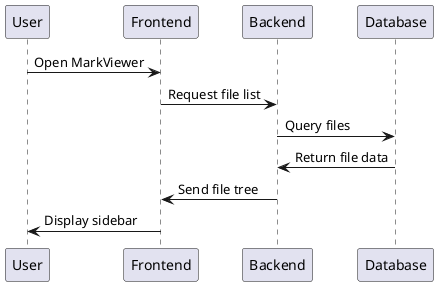
```

**Class Diagram:**
```markdown
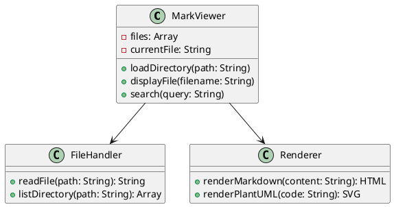
```

**3. Flowcharts and Process Diagrams**

**Decision Flow:**
```markdown
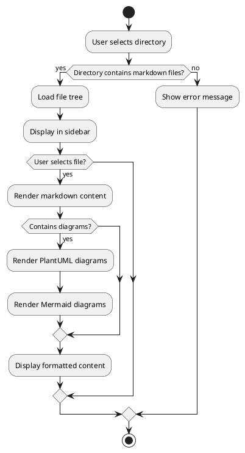
```

**4. System Architecture Diagrams**

**Component Diagram:**
```markdown
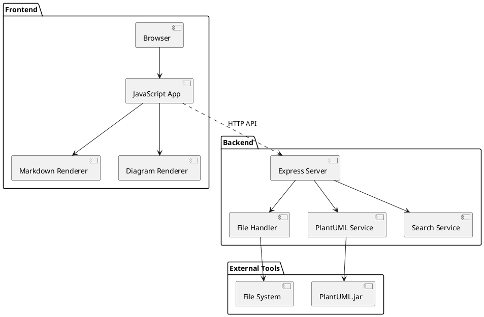
```

**5. Advanced PlantUML Features**

**Styling and Colors:**
```markdown
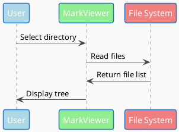
```

**6. Troubleshooting PlantUML**

**Common Issues and Solutions:**

**Problem: Diagrams not rendering**
```markdown
<!-- Check your PlantUML syntax -->
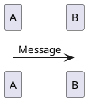
```

**Problem: Java not found**
- Verify Java installation: `java -version`
- Ensure PATH includes Java
- Re-run setup: `npm run setup`

**Problem: Complex diagrams timeout**
- Simplify the diagram
- Split into multiple smaller diagrams
- Increase timeout in `backend/services/plantuml-service.js`

---

## How to Create Mermaid Diagrams

### Problem
You want to create interactive diagrams using Mermaid syntax for flowcharts, sequence diagrams, and other visualizations.

### Solution

**1. Mermaid Syntax Overview**

Use fenced code blocks with `mermaid`:

**2. Flowcharts**

**Basic Flowchart:**
```markdown
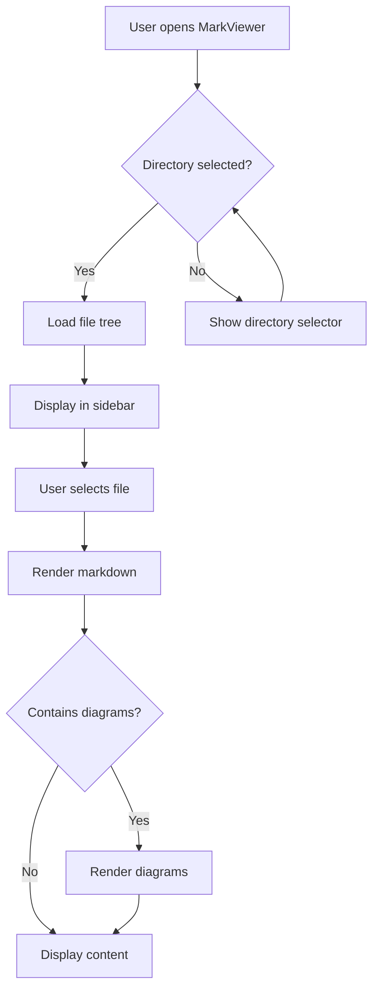
```

**Left-to-Right Flow:**
```markdown
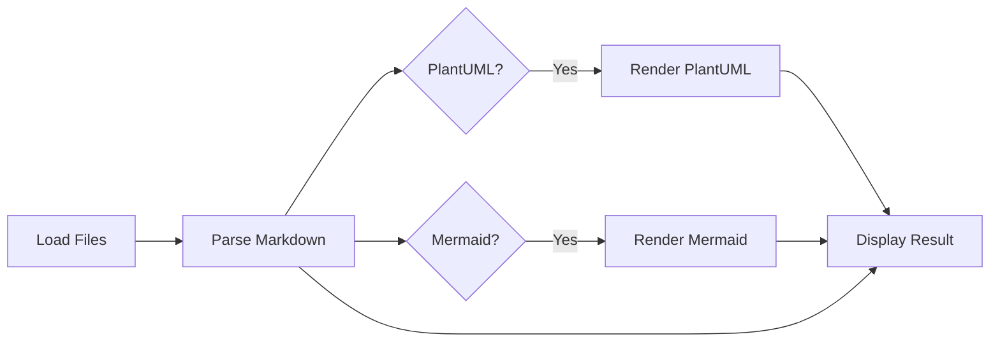
```

**3. Sequence Diagrams**

**User Interaction Flow:**
```markdown
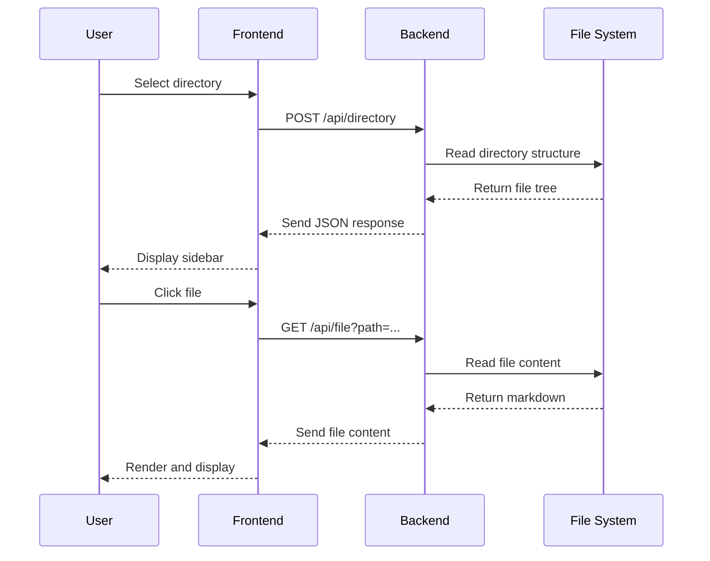
```

**4. Git Workflows**

**Branching Strategy:**
```markdown
```mermaid
gitgraph
    commit id: "Initial commit"
    branch feature-search
    checkout feature-search
    commit id: "Add search API"
    commit id: "Add search UI"
    checkout main
    commit id: "Bug fix"
    merge feature-search
    commit id: "Release v1.1"
    branch feature-diagrams
    checkout feature-diagrams
    commit id: "Add PlantUML"
    commit id: "Add Mermaid"
    checkout main
    merge feature-diagrams
    commit id: "Release v1.2"
```
```

**5. State Diagrams**

**Application State:**
```markdown
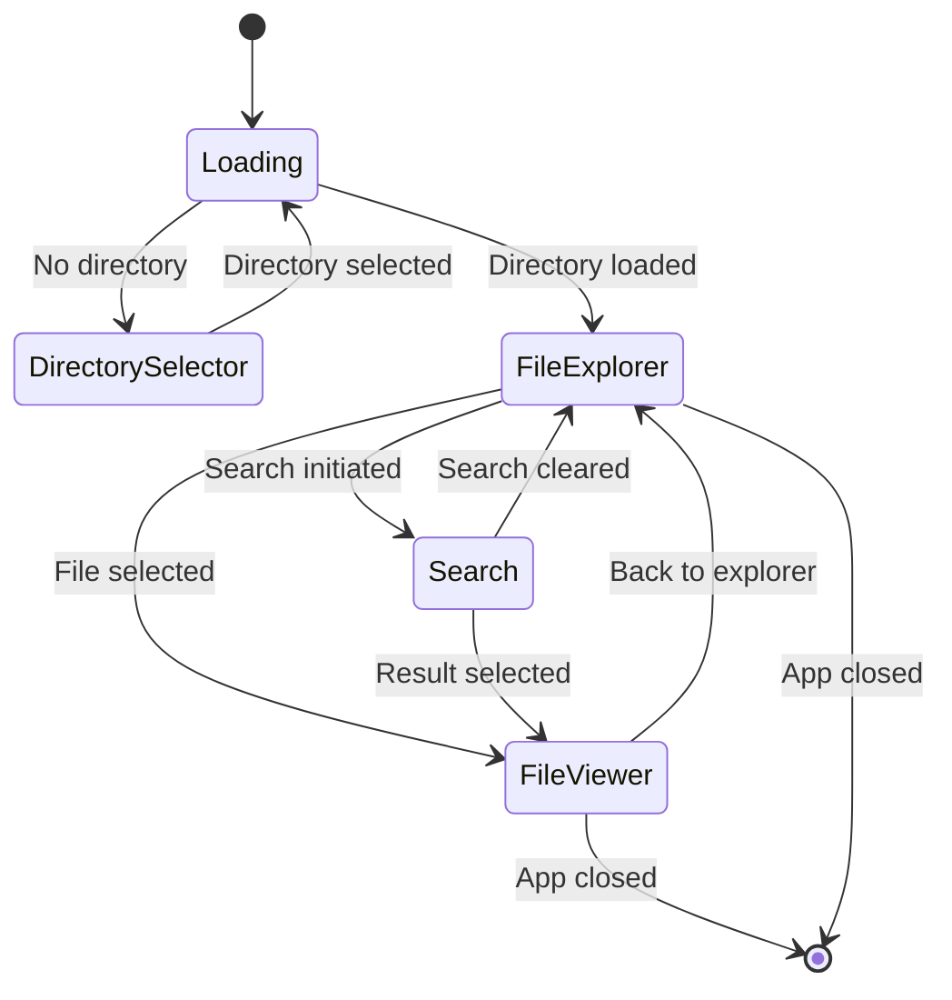
```

**6. Entity Relationship Diagrams**

**Data Structure:**
```markdown
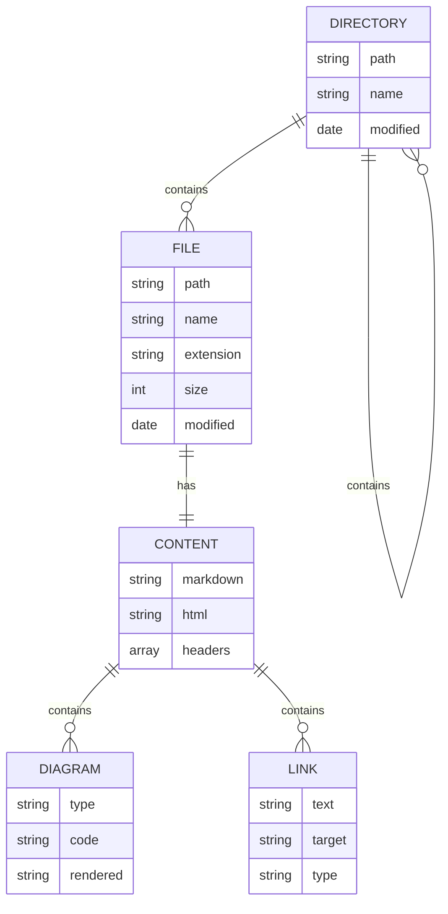
```

**7. Combining Diagrams in Documentation**

**Create comprehensive documentation with multiple diagram types:**

```markdown
# System Architecture Documentation

## Overview Flow

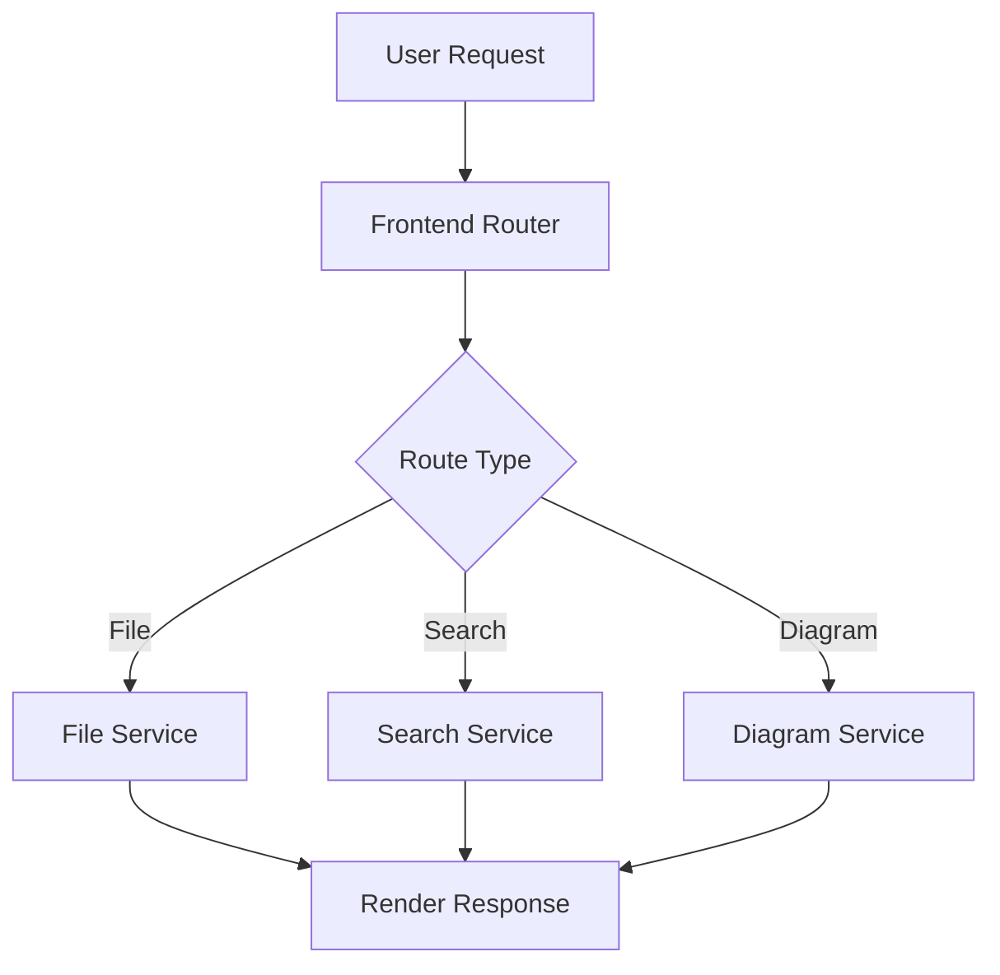

## Detailed Sequence

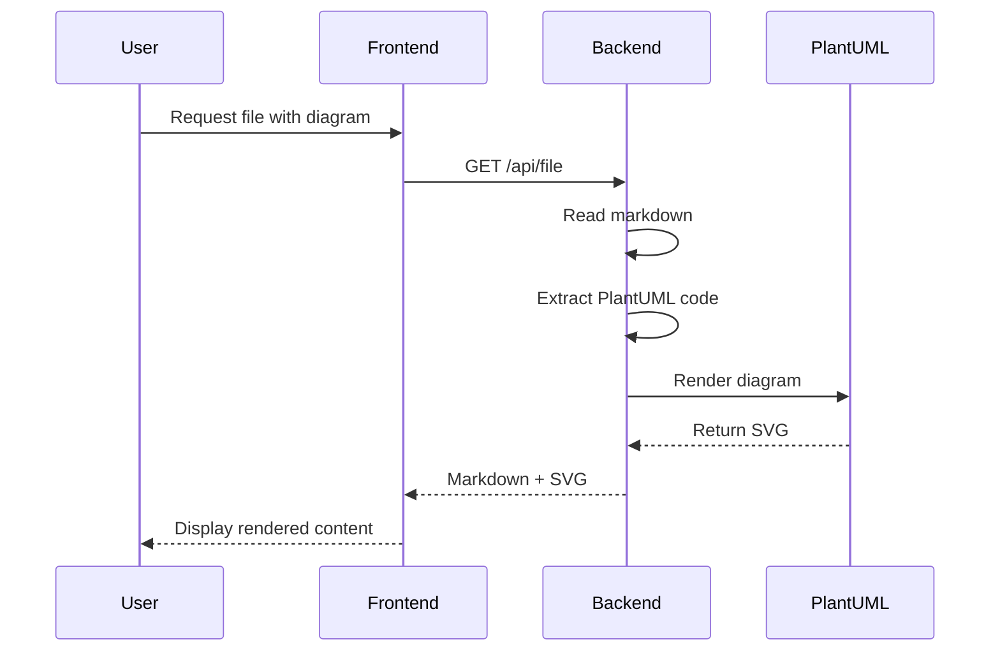

## State Management

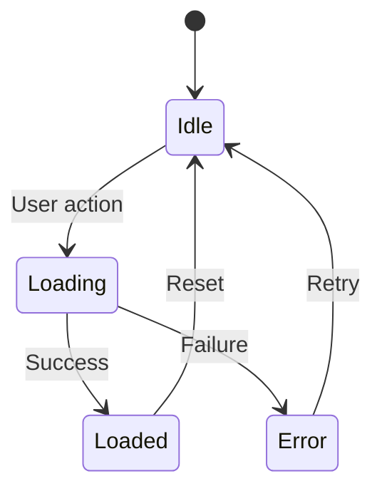
```

---

## How to Search Effectively

### Problem
You have a large collection of markdown files and need to find specific information quickly and accurately.

### Solution

**1. Basic Search Techniques**

**Simple Text Search:**
- Type any word or phrase in the search box
- MarkViewer searches through all file content
- Results show matching files with context snippets

**Example searches:**
- `installation` - finds setup instructions
- `PlantUML` - finds diagram-related content
- `troubleshooting` - finds help sections

**2. Advanced Search Patterns**

**Code Block Search:**
```
```javascript    # Find JavaScript code blocks
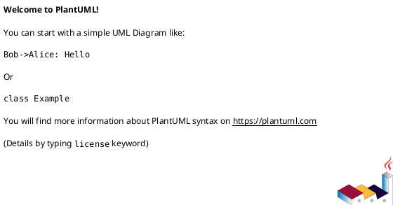

**Markdown Syntax Search:**
```
## Installation   # Find section headers
[link text]      # Find link definitions
![image alt]     # Find image references
| Table |        # Find tables
```

**3. Search by File Type or Location**

While MarkViewer searches content, you can use naming conventions to target searches:

**Filename Patterns:**
- Search for `getting-started` to find beginner content
- Search for `api-reference` to find technical docs
- Search for `troubleshooting` to find help content

**4. Using Search Results Effectively**

**Understanding Results:**
- **File path** shows location in directory structure
- **Preview snippet** shows surrounding context
- **Highlighted terms** show exact matches
- **Click any result** to navigate to that file

**Search Result Navigation:**
1. **Scan preview snippets** to find the most relevant result
2. **Click the result** to open the file
3. **Use browser find** (Ctrl+F) to locate the exact term in the file
4. **Use "Back" button** or breadcrumbs to return to search results

**5. Organizing Content for Better Search**

**Use Descriptive Headers:**
```markdown
## Installing on Windows
## Installing on macOS
## Installing on Linux

# Troubleshooting Installation Issues
# Troubleshooting Runtime Problems
# Troubleshooting Performance Issues
```

**Include Searchable Keywords:**
```markdown
# API Authentication Guide

This guide covers authentication, auth, login, tokens, and security.

Keywords: authentication, authorization, login, logout, tokens, JWT, security, credentials
```

**6. Search Workflow Examples**

**Finding Installation Instructions:**
1. Search: `installation`
2. Look for results in `getting-started` or `setup` folders
3. Click the most relevant result
4. Follow cross-links to related topics

**Finding Error Solutions:**
1. Search: error message text (e.g., `"Cannot find module"`)
2. Look for results in `troubleshooting` folders
3. Check both exact matches and similar issues
4. Follow links to related diagnostic steps

**Finding Code Examples:**
1. Search: programming language name (e.g., `javascript`)
2. Look for code block previews in results
3. Check multiple examples for best practices
4. Note file locations for future reference

---

## How to Troubleshoot Common Issues

### Problem
You're experiencing issues with MarkViewer and need systematic approaches to identify and resolve problems.

### Solution

**1. MarkViewer Won't Start**

**Symptoms:**
- Server fails to start
- Port conflicts
- Installation errors

**Diagnostic Steps:**
```bash
# Check Node.js version
node --version
# Should be v14.0.0 or higher

# Check if ports are available
lsof -i :3001  # Backend port
lsof -i :8080  # Frontend port

# Check Java installation (for PlantUML)
java -version
```

**Solutions:**
```bash
# Kill conflicting processes
pkill -f "node.*server.js"
pkill -f "python3.*8080"

# Reinstall dependencies
rm -rf node_modules backend/node_modules frontend/node_modules
npm run install-all

# Use different ports if needed
# Edit backend/server.js and frontend package.json
```

**2. Files Not Loading or Displaying**

**Symptoms:**
- Sidebar shows no files
- Selected files don't display
- Error messages about file access

**Diagnostic Steps:**
1. **Check directory path** - ensure it exists and contains .md files
2. **Check permissions** - ensure MarkViewer can read the directory
3. **Check file encoding** - ensure files are UTF-8 encoded
4. **Check browser console** - look for JavaScript errors

**Solutions:**
```bash
# Check directory contents
ls -la /path/to/your/markdown/directory

# Check file permissions
chmod -R 755 /path/to/your/markdown/directory

# Verify file encoding
file /path/to/your/markdown/file.md
# Should show: UTF-8 Unicode text
```

**In MarkViewer:**
- Try a different directory with known .md files
- Check browser developer tools (F12) for errors
- Clear browser cache and reload

**3. PlantUML Diagrams Not Rendering**

**Symptoms:**
- PlantUML code blocks show as plain text
- Error messages about Java or PlantUML
- Diagrams timeout or fail to load

**Diagnostic Steps:**
```bash
# Verify PlantUML jar exists
ls -la tools/plantuml.jar

# Test PlantUML directly
echo "@startuml\nA -> B\n@enduml" | java -jar tools/plantuml.jar -p

# Check Java classpath
java -cp tools/plantuml.jar net.sourceforge.plantuml.PlantUml -version
```

**Solutions:**
```bash
# Re-download PlantUML
npm run download-plantuml

# Test with simple diagram
```

**Create test file `test-plantuml.md`:**
```markdown
# PlantUML Test

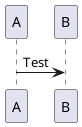
```

**If still failing:**
- Check `backend/services/plantuml-service.js` logs
- Increase timeout values in the service
- Try simpler diagrams first

**4. Search Not Working**

**Symptoms:**
- Search returns no results
- Search box doesn't respond
- Search results don't navigate correctly

**Diagnostic Steps:**
1. **Check backend connection** - ensure API server is running
2. **Test with known content** - search for text you know exists
3. **Check browser network tab** - look for failed API calls
4. **Verify file content** - ensure files contain searchable text

**Solutions:**
```bash
# Test backend API directly
curl "http://localhost:3001/api/search?q=test&path=/your/directory"

# Check backend logs for errors
# Backend should show search requests and responses
```

**In browser:**
- Open Developer Tools (F12)
- Check Network tab during search
- Look for failed requests to `/api/search`
- Verify search API returns JSON results

**5. Performance Issues**

**Symptoms:**
- Slow file loading
- Laggy navigation
- Browser freezing
- High memory usage

**Diagnostic Steps:**
```bash
# Check directory size
find /path/to/markdown -name "*.md" | wc -l
# Count of markdown files

# Check largest files
find /path/to/markdown -name "*.md" -exec wc -c {} + | sort -n | tail -10
```

**Solutions:**

**For large directories (1000+ files):**
- Split into smaller subdirectories
- Use more specific directory selection
- Consider excluding unnecessary files

**For large files (>1MB):**
- Split large files into smaller sections
- Use links between related sections
- Consider moving large files to subdirectories

**Browser optimization:**
- Clear browser cache
- Close other tabs/applications
- Use latest browser version

**6. Browser Compatibility Issues**

**Symptoms:**
- Features not working in specific browsers
- JavaScript errors
- Display problems

**Solutions:**

**Update browser** to latest version:
- Chrome: Latest stable
- Firefox: Latest stable  
- Safari: Latest macOS version
- Edge: Latest stable

**Check browser console** (F12) for specific errors

**Try different browser** to isolate the issue

**7. MIME Type Errors**

**Symptoms:**
- "Expected a JavaScript module script" errors
- Files not loading correctly
- Server-related errors

**Solutions:**
```bash
# Use the included development server
npm run dev
# This includes proper MIME type handling

# If using different server, ensure .js files served as application/javascript
# and .mjs files served as application/javascript
```

**8. General Debugging Workflow**

**Step 1: Reproduce the Issue**
- Document exact steps that cause the problem
- Note error messages exactly
- Try with different files/directories

**Step 2: Check System Requirements**
- Node.js version ≥ 14
- Java installed and accessible
- Modern browser
- Sufficient disk space

**Step 3: Check Logs**
- Browser console (F12 → Console)
- Backend terminal output
- Network requests (F12 → Network)

**Step 4: Isolate the Problem**
- Try with simple test files
- Test individual features separately
- Use different directories

**Step 5: Apply Systematic Solutions**
- Start with simplest solutions
- Test one change at a time
- Document what works

**Emergency Reset:**
```bash
# Complete fresh start
cd markviewer
rm -rf node_modules backend/node_modules frontend/node_modules
npm run setup
npm run dev

# Test with simple directory structure
mkdir test-docs
echo "# Test" > test-docs/README.md
# Point MarkViewer to test-docs directory
```

---

**Need more help?** 
- Check the main [README.md](../README.md) for technical details
- Review the [Getting Started Tutorial](tutorial-getting-started.md) for step-by-step guidance
- Examine the example files in the `test-content/` directory for working examples
