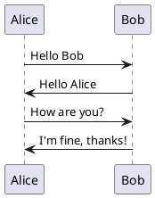
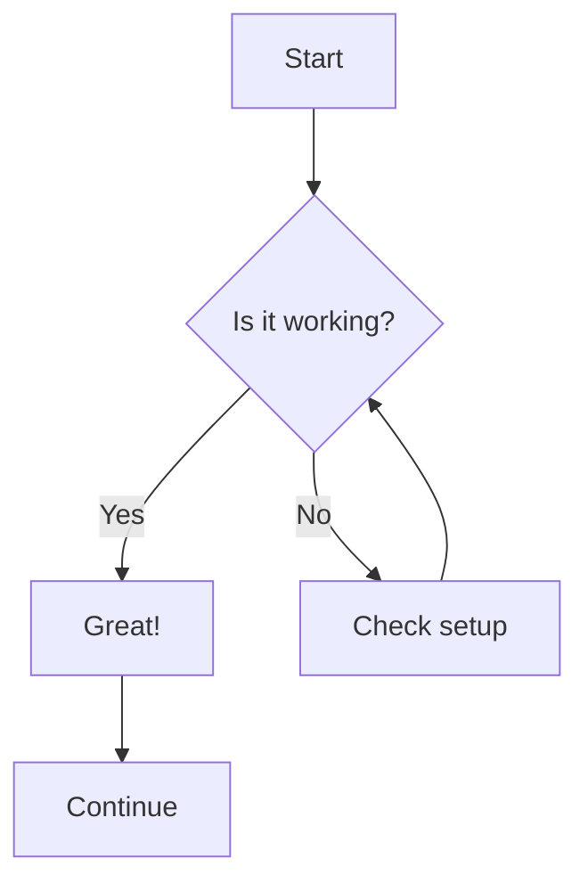
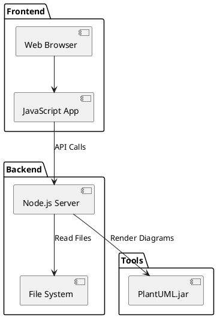
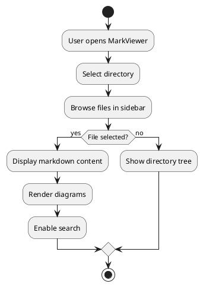
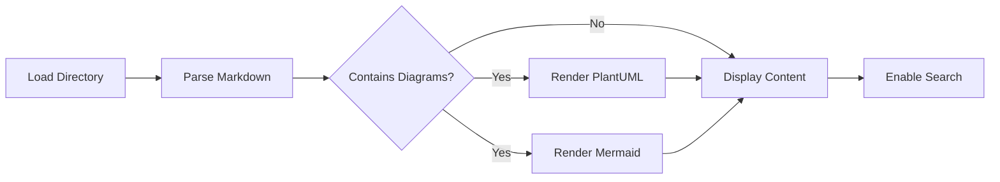

# Getting Started with MarkViewer

This tutorial will guide you through setting up and using MarkViewer to view your markdown files with all its powerful features.

## What You'll Learn

By the end of this tutorial, you'll be able to:
- ✅ Install and run MarkViewer on your system
- ✅ Load and navigate a directory of markdown files
- ✅ Use the recursive directory explorer effectively
- ✅ Create links between markdown files
- ✅ Render PlantUML and Mermaid diagrams
- ✅ Search across all your markdown files
- ✅ Use keyboard shortcuts for efficient navigation

## Prerequisites Check

Before we start, make sure you have:
- **Node.js** (version 14 or higher) - [Download here](https://nodejs.org/)
- **Java Runtime Environment** (for PlantUML support) - [Download here](https://www.oracle.com/java/technologies/downloads/)
- **A modern web browser** (Chrome, Firefox, Safari, or Edge)

### Quick Check Commands

Open your terminal and verify your setup:

```bash
# Check Node.js version
node --version
# Should show v14.0.0 or higher

# Check Java version
java -version
# Should show Java 8 or higher
```

## Step 1: Installation and Setup

### Download and Install

1. **Clone or download MarkViewer** to your computer
2. **Open terminal** and navigate to the MarkViewer directory
3. **Run the setup command**:

```bash
cd markviewer
npm run setup
```

This command will:
- Install all required dependencies
- Download the PlantUML jar file
- Verify your Java installation

### What Happens During Setup

You should see output like this:
```
✓ Installing backend dependencies...
✓ Installing frontend dependencies...
✓ Downloading PlantUML jar file...
✓ Setup complete!
```

## Step 2: Starting MarkViewer

Start the application with one simple command:

```bash
npm run dev
```

You'll see:
```
[Backend] Server running on http://localhost:3001
[Frontend] Development server running on http://localhost:8080
✓ MarkViewer is ready!
```

**Open your browser** and go to: `http://localhost:8080`

## Step 3: Loading Your First Markdown Directory

### Prepare Sample Content

Let's create a sample directory structure to explore MarkViewer's features:

```
my-docs/
├── README.md
├── getting-started/
│   ├── introduction.md
│   └── setup.md
├── guides/
│   ├── user-guide.md
│   └── advanced/
│       ├── diagrams.md
│       └── linking.md
└── examples/
    ├── plantuml-example.md
    └── mermaid-example.md
```

### Example Files to Create

**1. Create `my-docs/README.md`:**
```markdown
# My Documentation

Welcome to my documentation collection!

## Navigation
- [Getting Started](getting-started/introduction.md)
- [User Guide](guides/user-guide.md)
- [Advanced Topics](guides/advanced/diagrams.md)
- [Examples](examples/plantuml-example.md)

## Quick Links
- See [Setup Instructions](getting-started/setup.md) for installation
- Check out [Diagram Examples](examples/mermaid-example.md) for visual guides
```

**2. Create `my-docs/getting-started/introduction.md`:**
```markdown
# Introduction

This is an introduction to our documentation system.

## Features
- Recursive directory browsing
- Cross-document linking
- Diagram support

[Next: Setup Instructions](setup.md)
[Back to Home](../README.md)
```

**3. Create `my-docs/examples/plantuml-example.md`:**
# PlantUML Examples

Here's a simple sequence diagram:



[See more examples](mermaid-example.md)

**4. Create `my-docs/examples/mermaid-example.md`:**
# Mermaid Examples

Here's a flowchart:



[Back to PlantUML](plantuml-example.md)

### Load Your Directory

1. **In MarkViewer browser window**, click **"Select Root Directory"**
2. **Enter the full path** to your `my-docs` folder:
   - Windows: `C:\Users\YourName\my-docs`
   - Mac/Linux: `/Users/YourName/my-docs`
3. **Click "Load Directory"**

## Step 4: Exploring the Recursive Directory Explorer

### Understanding the Sidebar

Once loaded, you'll see the sidebar with your directory structure:

```
📁 my-docs/
├── 📄 README.md
├── 📁 getting-started/
│   ├── 📄 introduction.md
│   └── 📄 setup.md
├── 📁 guides/
│   ├── 📄 user-guide.md
│   └── 📁 advanced/
│       ├── 📄 diagrams.md
│       └── 📄 linking.md
└── 📁 examples/
    ├── 📄 plantuml-example.md
    └── 📄 mermaid-example.md
```

### Navigation Features

**Expanding/Collapsing Directories:**
- Click the **folder icon** or **folder name** to expand/collapse
- **Arrow keys** to navigate up/down
- **Right arrow** to expand, **Left arrow** to collapse

**File Selection:**
- Click any **markdown file** to view its content
- **Enter key** to open the selected file
- File content appears in the main viewing area

### Try This Exercise

1. **Click on different folders** - notice how they expand to show subdirectories
2. **Navigate to `examples/plantuml-example.md`** - you should see the diagram render
3. **Open `examples/mermaid-example.md`** - the flowchart should display
4. **Use arrow keys** to navigate the sidebar without using your mouse

## Step 5: Working with Cross-Document Links

### Understanding Link Types

MarkViewer supports several link formats:

**1. Relative Links (Recommended):**
```markdown
[Link text](../other-folder/file.md)
[Same folder](file-in-same-folder.md)
[Subfolder](subfolder/file.md)
```

**2. Absolute Links from Root:**
```markdown
[Link text](/guides/user-guide.md)
```

### Link Navigation Exercise

1. **Open `README.md`** from the sidebar
2. **Click on "Getting Started"** link - it should navigate to `getting-started/introduction.md`
3. **In the introduction file**, click "Next: Setup Instructions" - navigates to `setup.md`
4. **Click "Back to Home"** - returns to `README.md`

### Creating Effective Link Structures

**Best Practices for Linking:**

```markdown
<!-- Navigation breadcrumb -->
[Home](../README.md) > [Guides](../guides/README.md) > Current Page

<!-- Forward/backward navigation -->
[← Previous: Introduction](introduction.md) | [Next: Advanced Topics →](advanced/diagrams.md)

<!-- Related links section -->
## Related Topics
- [Diagram Examples](../examples/plantuml-example.md)
- [Search Guide](search-guide.md)
- [Keyboard Shortcuts](shortcuts.md)
```

## Step 6: Working with Diagrams

### PlantUML Diagrams

**Create a new file** `my-docs/diagrams-demo.md`:

# Diagram Demonstrations

## System Architecture



## User Flow



### Mermaid Diagrams

**Add to the same file:**

## Process Flow



**Save the file** and open it in MarkViewer to see all diagrams render!

## Step 7: Using Search Features

### Basic Search

1. **Click the search box** at the top (or press `Ctrl+K`/`Cmd+K`)
2. **Type a search term**, for example: "diagram"
3. **View results** with file paths and preview snippets
4. **Click any result** to navigate to that file

### Advanced Search Examples

**Search for specific content:**
- `PlantUML` - finds all files mentioning PlantUML
- `@startuml` - finds files with PlantUML code blocks
- `mermaid` - finds Mermaid-related content

**Search with context:**
- Search results show surrounding text
- **Highlighted terms** in the preview
- **File path** shows location in directory structure

### Search Exercise

1. **Search for "introduction"** - should find multiple files
2. **Click on a result** - notice how it navigates and highlights
3. **Search for "```plantuml"** - finds files with PlantUML code
4. **Try searching for "flowchart"** - finds Mermaid examples

## Step 8: Keyboard Shortcuts

### Essential Shortcuts

| Shortcut | Action |
|----------|--------|
| `Ctrl+K` / `Cmd+K` | Focus search box |
| `Ctrl+B` / `Cmd+B` | Toggle sidebar |
| `Escape` | Clear search or close mobile sidebar |
| `↑` `↓` | Navigate in sidebar |
| `→` | Expand folder |
| `←` | Collapse folder |
| `Enter` | Open selected file |

### Practice Exercise

1. **Press `Ctrl+B`** - sidebar should hide/show
2. **Press `Ctrl+K`** - search box should focus
3. **Press `Escape`** - search should clear
4. **Use arrow keys** in sidebar - navigate without mouse
5. **Press `Enter`** on a file - should open it

## Step 9: Organizing Large Document Collections

### Recommended Directory Structure

For larger documentation projects:

```
project-docs/
├── README.md                    # Main index
├── getting-started/            # User onboarding
│   ├── README.md               # Section index
│   ├── installation.md
│   └── first-steps.md
├── user-guides/                # How-to documentation
│   ├── README.md
│   ├── basic-usage.md
│   ├── advanced-features.md
│   └── troubleshooting.md
├── reference/                  # Technical reference
│   ├── README.md
│   ├── api-reference.md
│   └── configuration.md
├── examples/                   # Sample code and demos
│   ├── README.md
│   ├── basic-examples.md
│   └── advanced-examples.md
└── assets/                     # Images and resources
    ├── images/
    └── diagrams/
```

### Navigation Best Practices

**1. Create Index Files:**
```markdown
# User Guides

## Quick Start
- [Installation](installation.md)
- [First Steps](first-steps.md)

## Advanced Topics
- [Custom Configuration](advanced/configuration.md)
- [API Integration](advanced/api-integration.md)

## Troubleshooting
- [Common Issues](troubleshooting/common-issues.md)
- [Error Messages](troubleshooting/error-messages.md)
```

**2. Use Consistent Link Patterns:**
```markdown
<!-- Breadcrumb navigation -->
[Home](../../README.md) > [User Guides](../README.md) > Installation

<!-- Section navigation -->
| [← Previous](first-steps.md) | [Up](../README.md) | [Next →](advanced/configuration.md) |
```

## What's Next?

Congratulations! You've successfully learned how to use MarkViewer. Here's what you can explore next:

### Continue Learning
- **[How-to Guides](how-to-guides.md)** - Solve specific problems and learn advanced techniques
- **[Main README](../README.md)** - Technical details and configuration options

### Create Your Documentation
1. **Organize your markdown files** using the directory structure suggestions
2. **Add cross-links** between related documents
3. **Include diagrams** to illustrate complex concepts
4. **Use search** to quickly find information

### Advanced Features
- **Customize styling** by modifying CSS files
- **Configure PlantUML** settings for your needs
- **Set up keyboard shortcuts** for your workflow

---

**Need help?** Check the [How-to Guides](how-to-guides.md) for solutions to specific problems!
